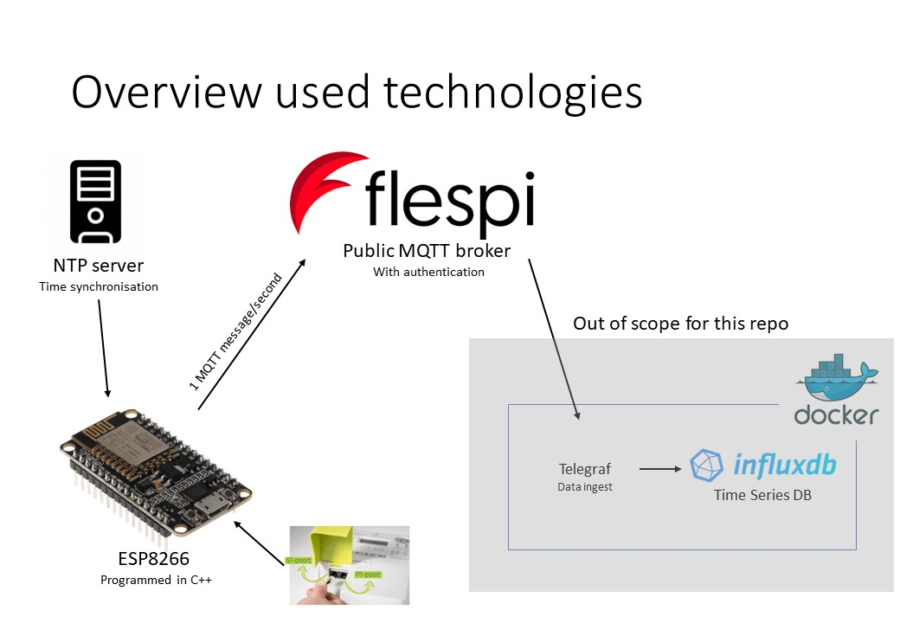

# P1 meter to MQTT
This Platform IO project should enable an ESP to read in data from a P1 energy meter and push this data in JSON format to a specified MQTT broker.



This meter situates itself inside a bigger project (see picture).

## MQTT output
One device can send data on multiple topics. The top level topic for a device is the MAC-address. Underneath this top level, there are three possible topics:
* [status](#status)
* [actual_values](#actual-values)
* [counters](#counters)


### Status
On first connection with the MQTT-broker, the device will send an "i'm alive message" on the topic `status/connection`.
* On connection, payload = `connected`
* On disconnection, payload = `disconnected`. This is the last will message of the device.


A general status update looks like the following:
```yaml
{
    'local_ip': '192.168.0.1',
    'rssi': '-60',
    'ssid': 'WaaiFaai',
    'source': 'on_startup',
    'time': '%02d/%02m/%04Y %02H:%02M:%02S',
    'uptime': '%4u days %02d:%02d:%02d'
}
```
This general status update could have different trigger sources:
* on_mqtt_request (if a message is received on `cmd/request_status`)
* on_reconnect (if the device is connected to the mqtt_broker)


### Actual values
Something about actual_values

### Counters
Something about counters


## Settings

## Tokens
Since this is a public repository and I do not know how to properly hide tokens, you'll just have to add a 'token.h' file yourself.The token.h file should be stored inside src folder.

The file should contain a line like this one:
#define MQTT_USERNAME "FlespiToken this_is_a_secret_token"
#define MQTT_PASSWORD "Some secret password you always use"